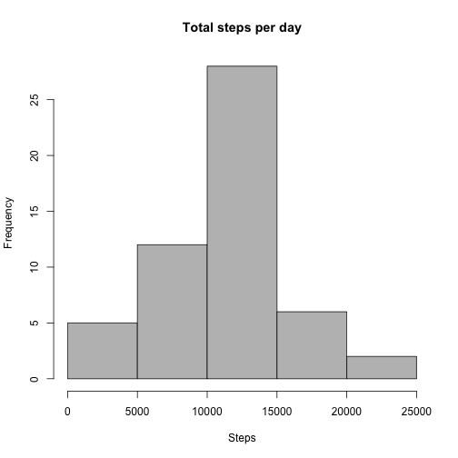
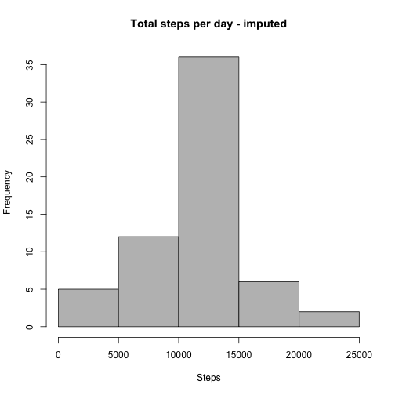
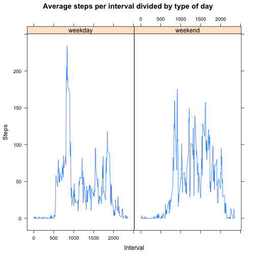

# Reproducible Research Project 1

## Reading the data

We start off by reading and processing the data:


```r
## Read the csv file to a data frame
activity <- read.csv("activity.csv")
```

##What is mean total number of steps taken per day?

Now we need to calculate the mean and the median of the steps taken per day.
Also we present a histogram with this information.


```r
## Make aggregation on steps for each date
stepsPerDay <- aggregate(activity$steps ~ activity$date, FUN = sum, na.action = na.omit)
names(stepsPerDay) <- c("Date", "steps")
stepsPerDay$Date <- as.Date(stepsPerDay$Date)

## Calculate mean and median
stepsPerDayMean <- as.integer(mean(stepsPerDay$steps))
stepsPerDayMedian <- median(stepsPerDay$steps)

## Histogram
hist (stepsPerDay$steps, freq = TRUE, main = "Total steps per day", xlab = "Steps", col = "grey")
```

 

The mean of the steps taken per day is **10766** and the median is **10765**.  

##What is the average daily activity pattern?

We need to find out at what interval during the day the highest number of steps are taken. We also present the average movements during the day in a plot.


```r
## Aggregate on steps and invervals
activityPerDay <- aggregate(activity$steps, by = list( activity$interval), FUN = mean, na.rm = TRUE)
names(activityPerDay) <- c("interval", "steps")

## Find the maximum interval and it's value
maxInterval <- activityPerDay[which.max(activityPerDay$steps),"interval"]
maxIntervalValue <- round(activityPerDay[which.max(activityPerDay$steps),"steps"], 
                          digits = 0)

## Plot
plot(activityPerDay$interval, activityPerDay$steps, type = "l", main = "Average Daily Frequency per inteval", xlab= "Interval", ylab = "Steps")
```

 

The maximum interval is **835** with on average **206** steps.

##Imputing missing values

The missing values will be imputed by making them reflect the average of the interval.


```r
## Count rows with NA
nNaRows <- nrow(activity[is.na(activity$steps == TRUE),])

## Declare function for finding average using data frame from earlier 
getIntervalAverage <- function (interval)
    {
        return(activityPerDay[activityPerDay$interval == interval,]$steps)
    }

## Make a copy if we might use the df later
activityFixed <- activity

## Loop thru NA's and add average
activityFixed[is.na(activityFixed$steps == TRUE),]$steps <- sapply(activityFixed[is.na(activityFixed$steps == TRUE),]$interval, FUN = getIntervalAverage)

## Aggregate on steps and date
stepsPerDayFixed <- aggregate(activityFixed$steps , by=list (activityFixed$date), FUN = sum)
names(stepsPerDayFixed) <- c("Date", "steps")
stepsPerDayFixed$Date <- as.Date(stepsPerDayFixed$Date)

## Find mean and median
stepsPerDayFixedMean <- as.integer(round(mean(stepsPerDayFixed$steps), digits = 0))
stepsPerDayFixedMedian <- as.integer(median(stepsPerDayFixed$steps))

## Histogram
hist (stepsPerDayFixed$steps, freq = TRUE, main = "Total steps per day - imputed", xlab = "Steps", col = "grey")
```

 

Total number or rows with NA is **2304**.

The mean of the steps taken per day is **10766** and the median is **10766**.  

##Are there differences in activity patterns between weekdays and weekends?


```r
##Loading lattice for use in our graph
library(lattice)

##Creating a function that returns if it is a weekday or weekend
wewd <- function (date)
    {
        if (as.POSIXlt(date)$wday %in% c(0,6)) day <- "weekend"
        else day <- "weekday"
        
        return (day)
    }

##loop over the dataset
activity$TypeOfDay <- as.factor(sapply(activity$date , FUN = wewd))

##Aggregate
stepsPerTypeOfDay <- aggregate(activity$steps, by = list(activity$interval, activity$TypeOfDay), FUN = mean, na.rm = TRUE)

names(stepsPerTypeOfDay) <- c("interval", "typeOfDay", "steps")

#Plot
xyplot(stepsPerTypeOfDay$steps ~stepsPerTypeOfDay$interval | stepsPerTypeOfDay$typeOfDay, type = "l", main = "Average steps per interval divided by type of day", xlab = "Interval", ylab = "Steps")
```

 


